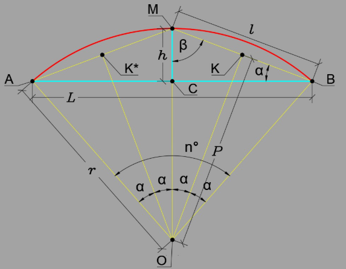

# Theoretical Basis of the Ovezov Arc Equation

This document provides a step-by-step mathematical derivation of the Ovezov Equation, explaining how it eliminates the need for radius and central angle measurements.

### 1. The Geometry of a Circular Segment
To understand the equation, we define the standard geometric properties of a circular segment:
* **$L$ (Chord)**: The straight line distance between the two ends of the arc (distance $AB$).
* **$h$ (Sagitta/Height)**: The maximum perpendicular distance from the chord to the arc ($MC$).
* **$r$ (Radius)**: The distance from the center of the circle $O$ to any point on the arc.
* **$Pn°$ (Arc Length)**: $P$ represents the distance along the curved path (red line), determined by the total central angle $n^\circ$.

### 2. Classical Formula Limitations
The standard way to find arc length $P$ is:
$$P = r \cdot \alpha$$
Where $\alpha$ is the central angle in radians. To find $P$ traditionally, one must locate the center $O$, measure the radius $r$, and determine the angle. In many field scenarios, the center of the circle is physically inaccessible, making this approach impractical.

### 3. The Derivation

#### Step A: Expressing Radius through $L$ and $h$
To derive the relationship, let us analyze the geometric construction shown in **Figure 1**:

1. Consider the triangles $\Delta MBC$ and $\Delta MKO$.
2. These two right-angled triangles share a common angle $\beta$.
3. Based on the similarity of these triangles, we apply the proportionality rule:

$$\frac{h}{l} = \frac{0.5l}{r}$$

4. From this proportion, we find the radius $r$:
$$r = \frac{0.5l^2}{h}$$

5. We substitute the value of the auxiliary chord $l$ (distance $MB$) using the Pythagorean theorem for the triangle $\Delta MBC$:
$$l^2 = h^2 + (L/2)^2 = h^2 + 0.25L^2$$

6. Substituting this into the equation for $r$ and moving the $0.5$ coefficient to the denominator, we get the final form:
$$r = \frac{h^2 + 0.25L^2}{2h}$$

#### Step B: Finding the Central Angle $\alpha$
Now we need to find the mathematical expression for the elemental central angle $\alpha$. According to the geometric construction, the total central angle $n^\circ$ is equal to $4\alpha$.

1. Using the properties of similar triangles and the geometry of the circle, we can determine the value of the angle $\alpha$.
2. From the relationship established in the construction, the trigonometric value of this angle is directly linked to the ratio of the height $h$ and the auxiliary chord $l$.
3. Thus, we can express $\alpha$ through the inverse trigonometric function:
$$\alpha = \arcsin\left(\frac{h}{\sqrt{h^2 + 0.25L^2}}\right)$$

#### Step C: Final Assembly and Simplification
The task is practically solved: we have the expression for the radius $r$ and the expression for the angle $\alpha$. Now, we combine them into the final arc length formula and perform the crucial simplification to eliminate $\pi$ and $360^\circ$.

1. **The Classical Formula (Degrees)**:
Initially, the arc length $P$ for a total angle $n^\circ = 4\alpha$ is written as:
$$P = \frac{2\pi r \cdot 4\alpha}{360}$$

2. **Eliminating the Constants**:
To simplify the equation, we convert the angular measurement from degrees to radians. Recall that $180^\circ$ is equal to $\pi$ radians. Therefore:
$$\frac{2\pi \cdot 4\alpha}{360} = \frac{\pi \cdot 4\alpha}{180} = \frac{4\alpha \text{ (in degrees)} \cdot \pi}{180} = 4\alpha \text{ (in radians)}$$
This step allows us to cancel out both $\pi$ and the degree constants ($180/360$), leaving us with a much cleaner relationship:
$$P = r \cdot (4\alpha_{\text{rad}})$$

3. **Substitution and Final Synthesis**:
Now, we substitute our derived $r = \frac{h^2 + 0.25L^2}{2h}$ and $\alpha = \arcsin\left(\frac{h}{\sqrt{h^2 + 0.25L^2}}\right)$:
$$P = \left( \frac{h^2 + 0.25L^2}{2h} \right) \cdot 4 \cdot \arcsin\left(\frac{h}{\sqrt{h^2 + 0.25L^2}}\right)$$

4. **The Ovezov Equation**:
By multiplying the $4$ from the angle by the $1/2$ from the radius ($4 \cdot 0.5 = 2$), we arrive at the final, "atomic" analytical solution:

$$P = \frac{2(h^2 + 0.25L^2)}{h} \arcsin\left(\frac{h}{\sqrt{h^2 + 0.25L^2}}\right)$$

### 4. Numerical Advantages
* **Singularity Handling**: As $h \to 0$, the formula gracefully approaches the length of the chord $L$.
* **Precision**: Matches **AutoCAD** industry standards up to 8 decimal places.
* **Efficiency**: No iterative loops, making it ideal for microcontrollers.

---
*For practical implementation details, please refer to the [README.md](./README.md).*

---

### History and Origins

The development of the Ovezov Arc Equation began several years ago. The first public discussion and detailed explanation of the logic were featured in a technical article on **isicad**, one of the leading platforms for CAD and engineering expertise.

---

### History and Origins

The development of the Ovezov Arc Equation was first introduced to the professional CAD community in early 2024. The mathematical logic and the quest for a direct solution were detailed in a technical publication on **isicad.ru**, a leading platform for engineering and PLM expertise.

You can read the original article here (in Russian):
🔗 [Длина дуги — поиски универсальной формулы](https://isicad.ru/ru/articles.php?article_num=23008)

This GitHub repository serves as the official implementation of the theory described in the article, providing ready-to-use code for modern engineering workflows.
